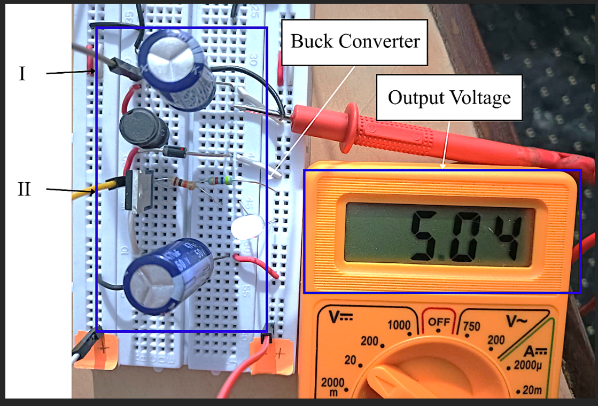

# Buck Converter PWM Control Test

## Hardware Setup

---

## Output Log

| Reading | Measured Voltage (V) | Error (V) | PWM Duty Cycle (%) |
| :---: | :---: | :---: | :---: |
| 1 | 4.902 | -0.098 | 40.79% |
| 2 | 4.985 | -0.015 | 41.62% |
| 3 | 4.941 | -0.059 | 41.18% |
| 4 | 4.922 | -0.078 | 40.99% |
| 5 | 4.936 | -0.064 | 41.13% |
| 6 | 4.878 | -0.122 | 40.55% |
| 7 | 4.878 | -0.122 | 40.55% |
| 8 | 4.878 | -0.122 | 40.55% |
| 9 | 4.809 | -0.191 | 39.86% |
| 10 | 4.883 | -0.117 | 40.60% |
| 11 | 4.848 | -0.152 | 40.25% |

---

## Analysis

### Control Loop Behavior
* The control loop is aiming for a nominal target of 5.00V ($\text{Error} = \text{Voltage} - 5.00\text{V}$).
* **Proportional Duty Adjustments**: The controller dynamically adjusts the PWM duty cycle between 39.86% and 41.62% to compensate for output voltage drops. Higher duty cycles correlate directly with higher output voltages.
* **Steady-State Performance**: 
  * **Mean Voltage**: ~4.896V across the logged run.
  * **Peak Performance**: Reached 4.985V (41.62% duty cycle) with a minimal error of -0.015V.
  * **Multimeter Verification**: The hardware multimeter reads 5.04V, showing close alignment with the microcontroller's internal ADC measurements, with a slight (~0.05V–0.15V) offset attributable to ADC calibration or sensing resistor tolerances.
